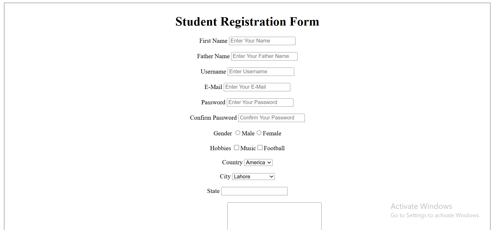

 

<!-- 🔰 BADGES -->

 
 

<h2 align="center">📝 Registration Form</h2>

A clean and simple **User Registration Form**,  
built using **HTML5** to collect user information.

<a href="https://registration-form-iota-steel.vercel.app/"><strong>➥ Live Demo</strong></a>

 

<!-- TABLE OF CONTENTS -->

  
📑 Table of Contents

  <ol>
    <li><a href="#about-the-project">About The Project</a></li>
    <li><a href="#features">Features</a></li>
    <li><a href="#built-with">Built With</a></li>
    <li><a href="#live-demo">Live Demo</a></li>
    <li><a href="#contact">Contact</a></li>
  </ol>

---

## 📖 About The Project

The **Registration Form** is my **second HTML project**, created to practice form elements and user input handling using pure **HTML5**.

This project focuses on collecting user data through structured input fields and demonstrates a solid understanding of form controls and layout fundamentals.

Perfect for:
- Beginner HTML practice  
- User data collection forms  
- Academic projects  
- Frontend portfolio starters  

(<a href="#top">back to top</a>)

---

## ✨ Features

- Clean and simple form layout  
- User-friendly input fields  
- Proper use of HTML form elements  
- Lightweight and fast  
- Easy to customize and extend  

(<a href="#top">back to top</a>)

---

## 🛠️ Built With

This project is built using:

- **HTML5**

(<a href="#top">back to top</a>)

---

## 🚀 Live Demo

Check out the deployed project here:

👉 **https://registration-form-iota-steel.vercel.app/**

(<a href="#top">back to top</a>)

---

## 📬 Contact

**GitHub:** https://github.com/codewith-salman  
**LinkedIn:** https://www.linkedin.com/in/muhammad-salmanarshad/  
**Email:** [msalmanwebdev@gmail.com](mailto:msalmanwebdev@gmail.com)

(<a href="#top">back to top</a>)

